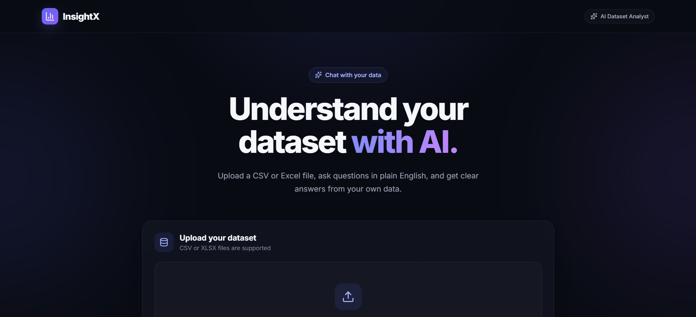
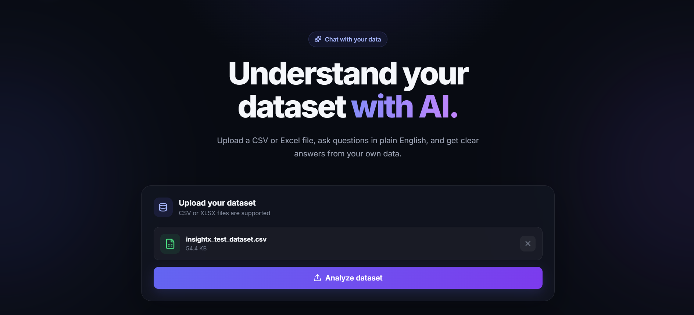
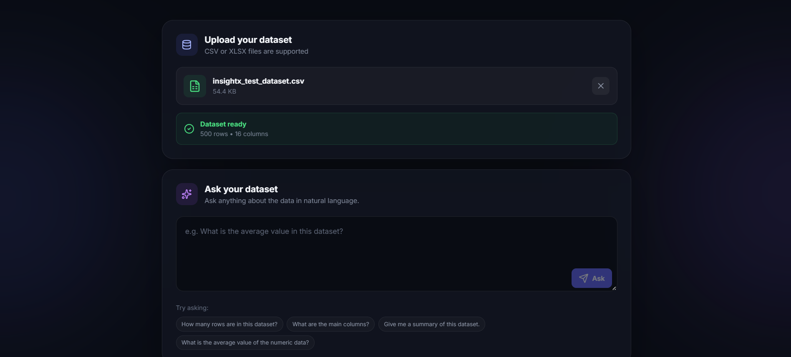

# InsightX 🚀

InsightX is an AI-powered "Chat With Your Dataset" platform that allows users to upload CSV/XLSX files and ask questions about their data using natural language.

It understands the user's question, creates a structured analysis plan, performs the actual calculation using Pandas, and returns a clear answer based on the uploaded dataset.

## Features ✨

- Upload CSV and XLSX datasets
- Automatic dataset profiling
- Natural-language data analysis
- Missing-value analysis
- Filtering and grouping
- Sorting and Top-N analysis
- Pandas-based data processing
- LLM-powered question understanding
- PostgreSQL database integration
- FastAPI backend
- React frontend

## Tech Stack 🛠️

- Python
- FastAPI
- React + Vite
- Pandas
- NumPy
- PostgreSQL
- SQLAlchemy
- OpenRouter
- Git & GitHub

## How It Works 🔄

User uploads CSV/XLSX
        ↓
Dataset Profiling
        ↓
User asks a question
        ↓
LLM creates analysis plan
        ↓
Pandas performs calculation
        ↓
Result is validated
        ↓
LLM generates the answer
        ↓
Answer displayed in React

## Project Screenshot 📸

## Sample Questions 💡

- How many employees are there?
- What is the average salary?
- Which department has the highest average salary?
- How many employees are there in each department?
- What is the average salary by job role?
- What is the total monthly sales by department?
- How many employees earn more than 100000?
- How many employees joined after January 1, 2024?
- How many employees have more than 5 years of experience?
- What are the top 5 highest-paid employees?

## Project Structure 📁

    insightx-ai-bi/
    ├── backend/
    │   ├── app/
    │   │   ├── models/
    │   │   ├── routes/
    │   │   └── services/
    │   └── requirements.txt
    │
    ├── frontend/
    │   ├── src/
    │   └── package.json
    │
    ├── data/
    │   ├── sample/
    │   └── uploads/
    │
    ├── Screenshots/
    │   └── insightx.png
    │
    ├── .gitignore
    ├── README.md
    └── LICENSE

## How to Run ▶️

### Backend

Create a virtual environment:

    python -m venv .venv

Activate it on Windows:

    .venv\Scripts\Activate.ps1

Install dependencies:

    pip install -r backend/requirements.txt

Configure PostgreSQL and OpenRouter credentials in:

    backend/.env

Start the backend:

    uvicorn backend.app.main:app --reload

Backend:

    http://127.0.0.1:8000

API Documentation:

    http://127.0.0.1:8000/docs

### Frontend

    cd frontend
    npm install
    npm run dev

Frontend:

    http://localhost:5173

## API Endpoints 🔌

    POST /api/v1/datasets/upload
    GET  /api/v1/datasets/
    GET  /api/v1/datasets/{dataset_id}
    POST /api/v1/analysis/{dataset_id}
    POST /api/v1/analysis/{dataset_id}/ask

## Future Improvements 🚀

- Interactive charts and dashboards
- User authentication
- Conversation history
- Advanced statistical analysis
- Multi-dataset analysis
- Docker deployment
- Cloud deployment

## Author

**Ayansh Singh**

GitHub: https://github.com/ayansh3006
